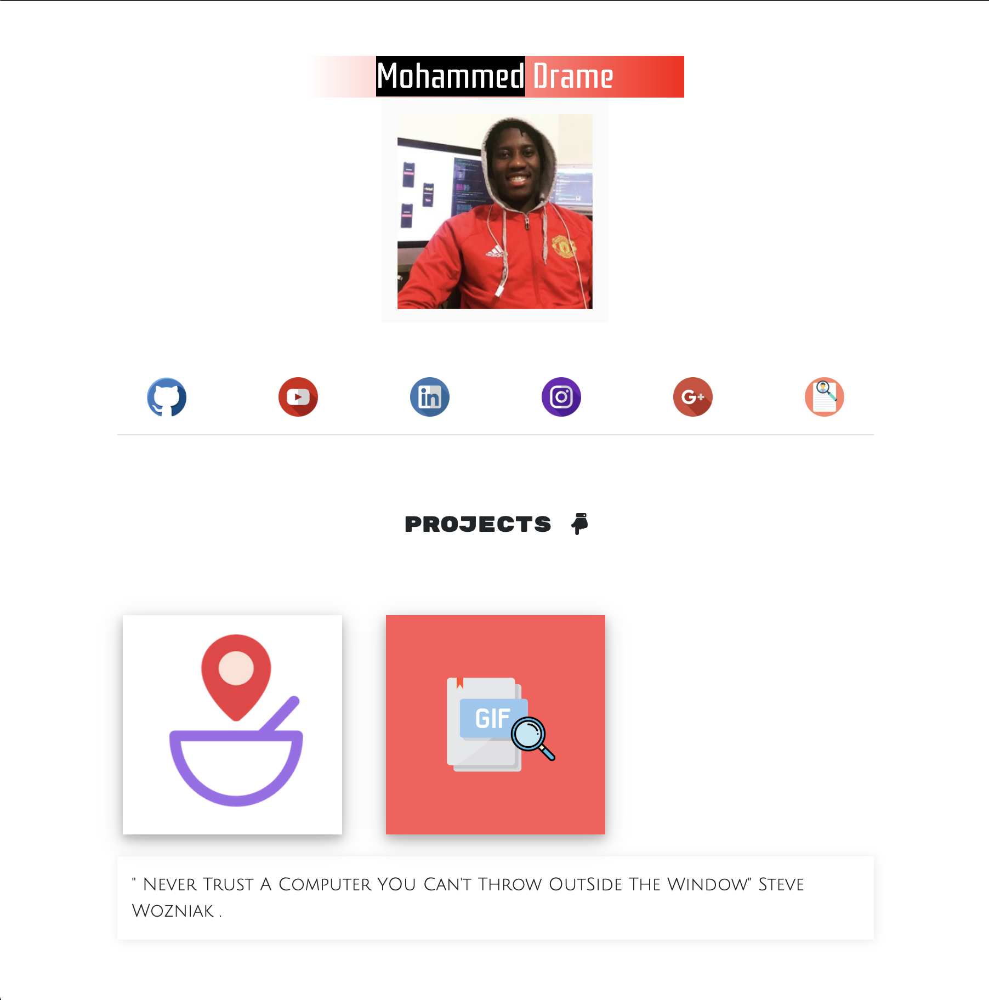

# SocialSite

#### Dash Board

### Usage

All you got to do is download repo and replace image, social links, and resume which is a .png. also you can add a new social link by copy and pasting the social div

#### Technology

* HTML
* CSS
* BootStrap
* Google Online Font-Family

#### todo

* post to hosting site / server. ✅ Done
* Create individual project page to show more detail about project
* give user uption to download resume
* user can visit project from show more detail page.

